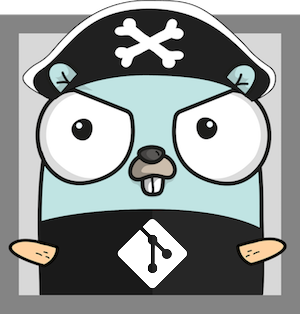

# Tortuga 🐢

**Fast, parallel Git operations across multiple repositories**

Tortuga is a modern CLI tool for managing multiple Git repositories simultaneously.
It can fetch, rebase, and push changes across all your repositories with a single command, providing real-time progress updates.

  

The name comes from the [West Indian island "Tortuga"](https://en.wikipedia.org/wiki/Tortuga_(Haiti)) (turtle island), which was a major center and haven of Caribbean piracy, hence the mascot.

---

## Features

*   **Parallel Operations**:\
     Process multiple repositories concurrently for maximum speed.
     Five by default, controllable via flag.

*   **Real-time Progress**:\
    Live updates showing the status of each repository as it gathers them.

*   **Smart Sync Options**:
    Choose between full sync or incoming-only updates.

*   **Colors**:
    Color-coded status with clear visual indicators.
    Can be disabled, and the tool respect `NO_COLOR`.

*   **Thread-safe**:
    Modern Go concurrency patterns with channels and errgroup

*   **Best-erffort**:
    Continue processing even if some repositories fail.

---

## Installation

### macOS (Homebrew)

```bash
brew install benweidig/homebrew-tap/tortuga
```

**From Source:**

```bash
go install github.com/benweidig/tortuga@latest
```

### Linux

**Pre-built Binaries:**

Download from [releases](https://github.com/benweidig/tortuga/releases) or use the provided `.deb` packages for Debian/Ubuntu.

AUR package is work in progress.

---

## How to Use

```bash
# Check all repositories in current directory
tt

# Check repositories in specific path
tt /path/to/my/projects

# Auto-sync all changes without prompting
tt --yes
```

---

## How It Works

1.  **Discovery**:\
    Tortuga scans the target directory according to a specific order:
    *   Root is itself a git repo
    *   Direct children of root are git repos
    *   Walk upward from root to find a parent repo

2.  **Fetch**:\
    Parallel fetch from all remotes to check for updates

3.  **Status Display**:
    Real-time status showing incoming/outgoing commits and local changes

4.  **Interactive Sync**: Choose your sync strategy:
    *   `y`: Full sync (stash, pull+rebase, push, unstash)
    *   `i`: Incoming only (stash, pull+rebase, unstash)
    *   `n`: No sync (just show status)

---

## Configuration

### Command Line Options

| Flag           | Short | Description                                 |
| -------------- | ----- | ------------------------------------------- |
| `--monochrome` | `-m`  | Disable ANSI colors                         |
| `--yes`        | `-y`  | Automatically accept sync prompts           |
| `--no`         | `-n`  | Fetch only (default if stdout is not a TTY) |
| `--jobs`       | `-j`  | Max. concurrent Git operations (default: 5) |
| `--help`       | `-h`  | Display help                                |
| `--version`    |       | Show version                                |

### Git Credentials

Tortuga performs operations asynchronously across multiple repositories, so it _cannot_ prompt for credentials interactively.

Ensure your Git credentials are configured via:

*   **SSH Keys**:\
    Recommended for seamless authentication

*   **Git Credential Helper**:\
    `git config credential.helper store`

*   **Git Credential Cache**:\
    `git config credential.helper cache`

### Color Support

Colors are automatically detected and disabled when:

*   Terminal doesn't support ANSI colors
*   `NO_COLOR` environment variable is set
*   `--monochrome` flag is used

---

## Building from Source

### Requirements

Tested on Go 1.26.1

### Build

```bash
git clone https://github.com/benweidig/tortuga.git
cd tortuga
make build
```

### Development

```bash
make all          # Full pipeline: clean, format, test, vet, staticcheck, build
make test         # Run tests
make fmt          # Format code
make vet          # Run go vet
make staticcheck  # Run staticcheck (if installed)
```

---

## AI Disclosure

This project originated as a 100% human project, as AI wasn't prevalent at the time.
I'm not a Go developer by trade, so I use AI as a _co-developer_ for assistance.

It's still human architecture decisions, with AI filling the gaps I'm not well versed in.
Brainstorming, proof-of-concepts, lending a hand with writing unit tests, or code review are areas where AI can effectively help.
But nothing beats a final human review to refine, and most importantly, to verify.

---

## License

MIT. See [LICENSE](LICENSE).

---

## Acknowledgments

*   Mascot design [based on Gopherize.me](https://gopherize.me/gopher/79e06dc4b7a8669c8aa0d6381af7f02f5474e3b7)

*   Git logo by [Jason Long](https://git-scm.com/downloads/logos) under CC BY 3.0

*   Original UI inspiration from [gosuri/uilive](https://github.com/gosuri/uilive) (MIT License)

---

## Contributing

Contributions are welcome!

Please feel free to submit a Pull Request.
For major changes, please open an issue first to discuss what you would like to change.
